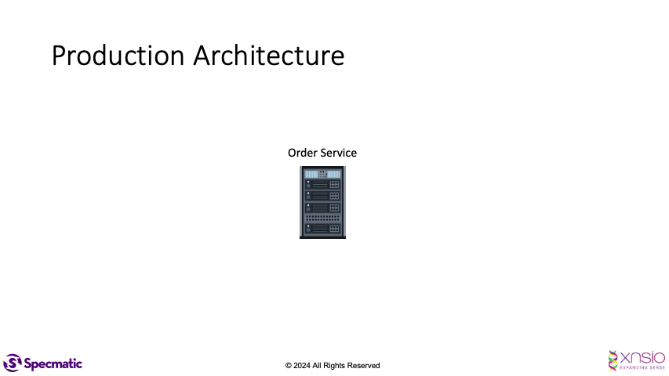
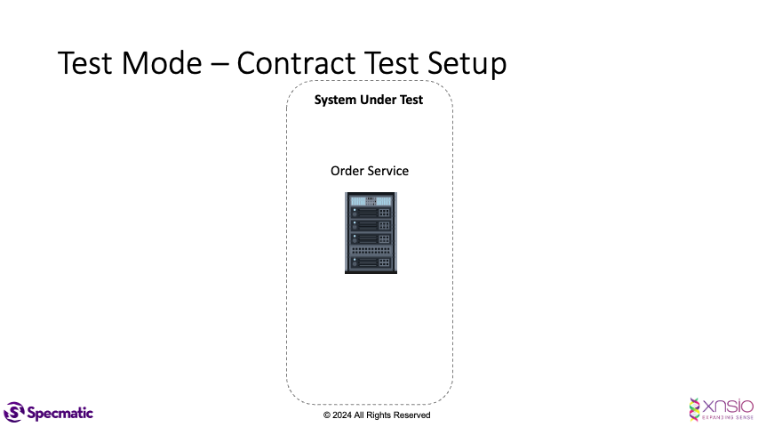

# Specmatic Google PubSub Sample

* [Specmatic Website](https://specmatic.in)
* [Specmatic Documentation](https://specmatic.in/documentation.html)

This sample project demonstrates how we can run contract tests against a service which interacts with a Google PubSub instance. 

## Pre-requisites
* Gradle
* JDK 17+
* Docker

## Run the tests
1. Start Docker Desktop.
2. Run the following command -
```shell
./gradlew clean test
```

## Application Architecture
The service under test is: **Order Service**.  
It listens for messages on a Google PubSub topic called **'place-order'**.  
For every message it receives, it sends a message on a Google PubSub topic: **process-order** 
We also have an async api specification defined for the Order Service in the **order_service.yaml** file.  
The **order_service.yaml** is defined as a 'test' contract in the [specmatic.json](https://specmatic.in/documentation/specmatic_json.html) file.





## Contract Tests
To run contract tests, Specmatic leverages the "named examples" defined in the async api specification of the Order Service.  
**Note**: As of now, contract tests will be generated only if there are named examples defined in the async api specification. 

Here's the structure of a contract test:
- Specmatic will use the named example defined for the **'place-order'** topic and publish a message on the **'place-order'** topic.  
  If the example message does not match the message schema of the the **'place-order'** topic, the test will fail.

- Specmatic will wait for the Order Service to process the message and publish a message on the **'process-order'** topic.

- Specmatic will then assert that :
  - Exactly one message each is received on the **process-order** topic
  - The message received on the **process-order** topic is the named example defined for the **'process-order'** topic.  
    The message received should match the message schema for the **process-order** topic

## Running the tests with the Google PubSub Emulator
This project is setup to use the Google PubSub emulator by default.  

1. Ensure that the PUBSUB_EMULATOR_HOST env variable is set appropriately while running tests. For this, add the following line in build.gradle.
```groovy
test {
  environment "PUBSUB_EMULATOR_HOST", "localhost:8085"
}
```

2. Make use of the ```PubSubEmulator``` utility class to start the Google PubSub emulator in the contract tests. Here's how to create the pubsub emulator by specifying your **project id** and a list of topics:
```kotlin
private val pubSubEmulator = PubSubEmulator(
            projectId = PROJECT_ID,
            topics = listOf(PLACE_ORDER_TOPIC, PROCESS_ORDER_TOPIC),
        )
```
3. Start the emulator in your ```@BeforeAll``` method
```kotlin
pubSubEmulator.start()
```

4. Stop the emulator in your ```@AfterAll``` method
```kotlin
pubSubEmulator.stop()
```

## Running the tests with a live Google PubSub project
You can also run your tests against a real/live Google PubSub project.
Here are the steps:
- Create the following three topics in your project: 
  - **place-order**
  - **process-order**

- Update the following with your Google PubSub project id:
  - **application.properties** (src/main/resources/)  
   ```yaml
  google.pubsub.projectId=pub-sub-demo-414308
  ```
  - **ContractTest**
  ```kotlin
   private const val projectId = "pub-sub-demo-414308"
  ```
- Remove the following line from the `test` section in **build.gradle**  
  ```
  environment "PUBSUB_EMULATOR_HOST", "localhost:8085"
  ```
- You would need to then set up some authentication mechanism using one of the options described [here](https://cloud.google.com/docs/authentication/provide-credentials-adc#how-to).  
  - **Service Account with Key**  
    If you are planning to use a service account key, add this line in **build.gradle** in the `test` section after `useJUnitPlatform()`:  
    ```
       environment "GOOGLE_APPLICATION_CREDENTIALS", "<path to your key file>"
    ```

  ## Troubleshooting
- If the contract tests fail due to expected messages not being received on the subscribe topics, try increasing the wait timeout of specmatic's ```GooglePubSubMock```. 
  
  For example, to make the ```GooglePubSubMock``` wait for 15 seconds, we can provide the timeout as follows -
  ```kotlin
  GooglePubSubMock.connectWithBroker(PROJECT_ID, messageWaitTimeoutInMilliseconds = 15000)
  ```

